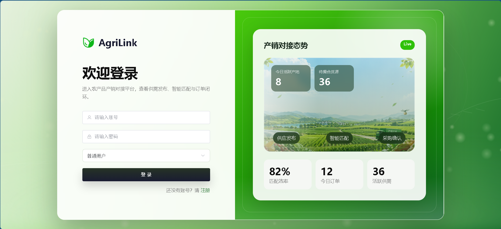
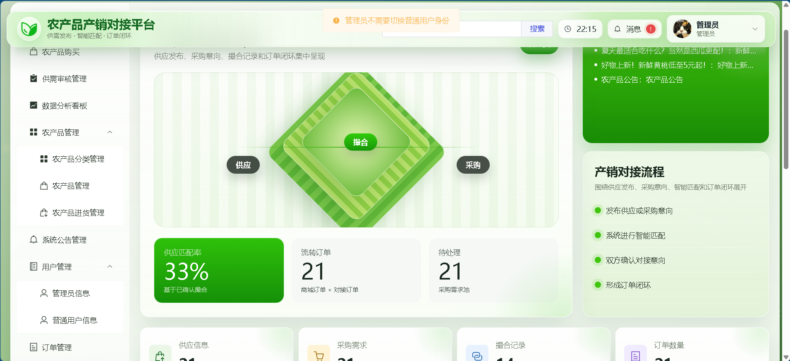
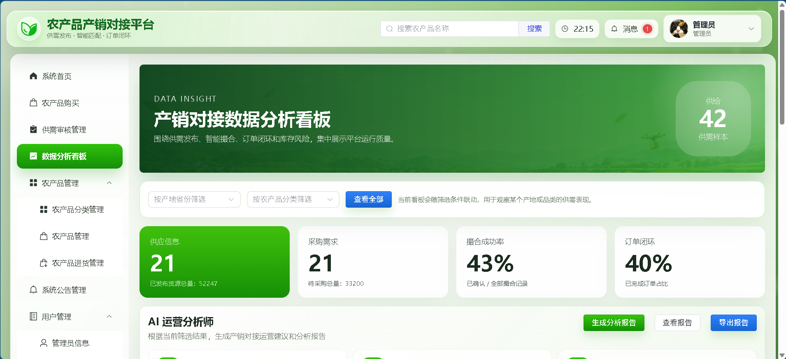
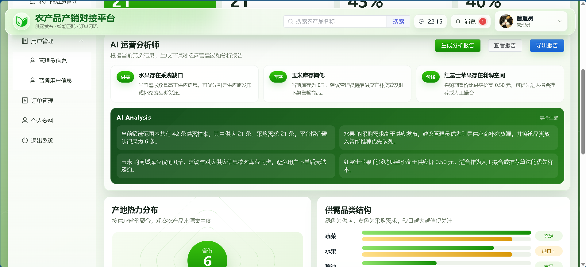
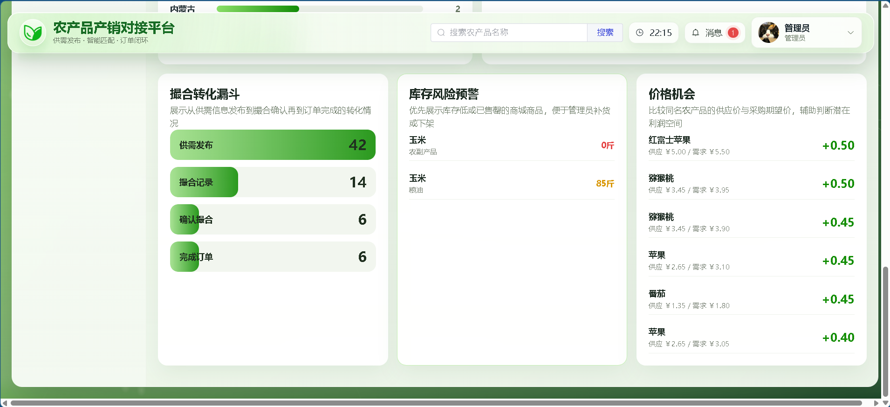
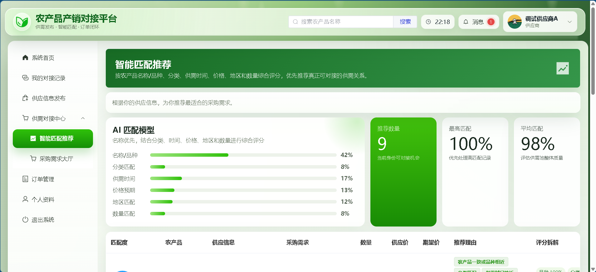

# 农产品产销对接平台

基于 Spring Boot + Vue + MySQL 的农产品产销对接平台，支持商品管理、供需发布、智能撮合、订单管理、库存管理等功能。

## 项目截图

### 登录页面

### 系统首页

### 数据分析

### 给采购商供应商相应的推荐

## 技术栈

- 后端：Spring Boot、MyBatis、MySQL
- 前端：Vue 3、Vite、Element Plus
- 构建工具：Maven、npm
